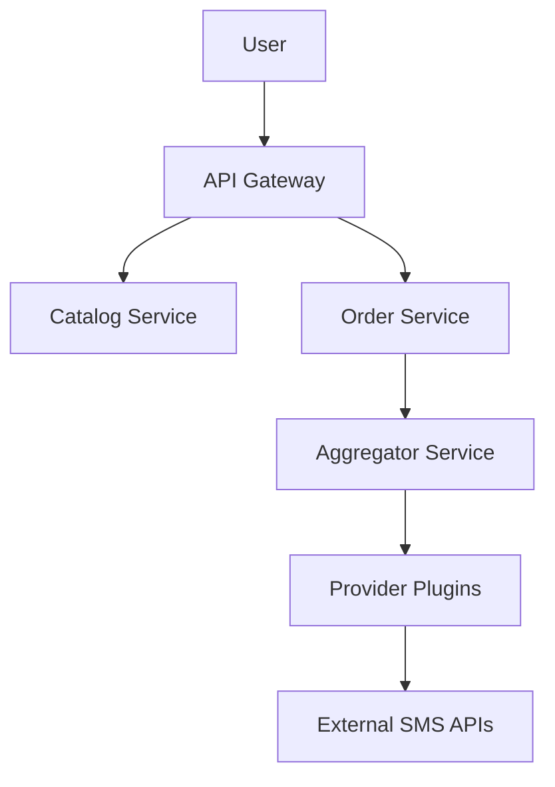

# smsWebsite

A distributed, event-driven SMS activation marketplace platform.

---

## 🚀 Overview

smsWebsite is a **multi-provider SMS marketplace aggregator** that allows users to:

- Browse virtual numbers across multiple providers
- Compare prices in real-time
- Purchase activation numbers
- Receive SMS codes
- Manage wallet and refunds

The system aggregates multiple external SMS providers into a **unified catalog**, hides provider complexity, and exposes a clean marketplace API.

---

## 🧠 System Philosophy

- **Provider-agnostic architecture**
- **Event-driven communication**
- **Plugin-based provider integration**
- **Strong domain separation**
- **Observability-first design**

---

## 🏗️ Architecture Style

- Microservices-based system
- Event-driven (RabbitMQ)
- Plugin architecture for providers
- API Gateway entry point
- Redis caching layer
- PostgreSQL per bounded context

---

## 📦 Core Domains

- **Catalog** → unified product marketplace
- **Order** → activation lifecycle management
- **Wallet** → user balance & transactions
- **Provider Layer** → external SMS services abstraction
- **SMS Service** → incoming message handling
- **Aggregator** → sync engine for providers

---

## 📁 Documentation Structure

All system documentation is located in `/docs`.

### 📌 Architecture & Design

- [Overview](docs/01-overview.md)
- [Requirements](docs/02-requirements.md)
- [Architecture](docs/03-architecture.md)
- [Workflow](docs/04-workflow.md)
- [Tech Stack](docs/05-tech-stack.md)
- [Folder Structure](docs/06-folder-structure.md)
- [Services](docs/07-services.md)

---

### 🧩 Architecture Decision Records (ADR)

Key architectural decisions:

- [Marketplace vs Provider Model](docs/adr/ADR-0001-marketplace-vs-provider.md)
- [Provider Plugin System](docs/adr/ADR-0002-provider-plugin-system.md)
- [Catalog Model](docs/adr/ADR-0003-catalog-model.md)
- [Order Ownership](docs/adr/ADR-0004-order-ownership.md)
- [Provider Plugin Contract](docs/adr/ADR-0005-provider-plugin-contract.md)

---

### 🌐 API Contracts

- [API Overview](docs/api/api-overview.md)
- [Catalog API](docs/api/catalog.yaml)
- [Order API](docs/api/order.yaml)
- [Versioning Strategy](docs/api/versioning.md)

---

### 🗄️ Data Model

- [Auth DB](docs/database/auth-db.md)
- [Catalog DB](docs/database/catalog-db.md)
- [Order DB](docs/database/order-db.md)
- [Wallet DB](docs/database/wallet-db.md)

---

### 🔌 Provider SDK

Defines how external SMS providers integrate into the system:

- [Interface](docs/sdk/provider-sdk/interface.md)
- [DTOs](docs/sdk/provider-sdk/dto.md)
- [Errors](docs/sdk/provider-sdk/errors.md)
- [Retry Strategy](docs/sdk/provider-sdk/retry.md)
- [Auth](docs/sdk/provider-sdk/auth.md)
- [Rate Limiting](docs/sdk/provider-sdk/rate-limit.md)
- [Lifecycle](docs/sdk/provider-sdk/lifecycle.md)
- [Versioning](docs/sdk/provider-sdk/versioning.md)

---

### ⚡ Event System

- [Event Model](docs/events/event-model.md)
- [Event Flow](docs/events/event-flow.md)
- [Versioning](docs/events/versioning.md)

---

### 📊 Observability

- [Logging Strategy](docs/observability/logging.md)
- [Metrics (Prometheus)](docs/observability/metrics.md)
- [Tracing (Jaeger)](docs/observability/tracing.md)
- [Correlation ID](docs/observability/correlation-id.md)
- [Distributed Tracing Flow](docs/observability/distributed-tracing-flow.md)

---

### 🔐 Security

- [Security Model](docs/security/security.md)

---

### 🚀 Deployment

- [Deployment Strategy](docs/deployment/deployment.md)

---

### 📖 Glossary

- [System Glossary](docs/glossary.md)

---

## 🧩 Key Design Principles

### 1. Provider Isolation
Each SMS provider is implemented as a plugin and cannot affect core system logic.

### 2. Event-Driven Architecture
All state changes are propagated via events (RabbitMQ).

### 3. Immutable Catalog
Catalog is a read-only, aggregated snapshot of provider data.

### 4. Order-Centric Flow
Orders represent the lifecycle of SMS activation.

### 5. Observability First
Every request is traceable across services.

---

## 🔄 High-Level Flow

---

## 🛠️ Tech Stack

- Go (Backend)
- PostgreSQL
- Redis
- RabbitMQ
- React / Next.js (Frontend)
- TailwindCSS
- Docker + Kubernetes
- Nginx

---

## 📌 Status

This repository currently contains:

> 🟢 **Phase 1: Architecture Design (COMPLETE)**  
> 🔜 Phase 2: Engineering Implementation (NEXT)

---

## 🚀 Next Phase

The next step is implementation of:

- Go monorepo structure
- Provider plugin runtime loader
- Event bus implementation
- Aggregator engine
- Order state machine
- Redis caching strategy

---
## 📜 License

Copyright © 2026 Hossein Karimian

All rights reserved.

This software and its documentation are proprietary and confidential.

No part of this project may be copied, modified, distributed, or used without explicit written permission from the owner.