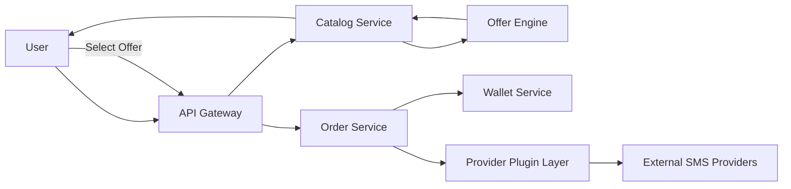
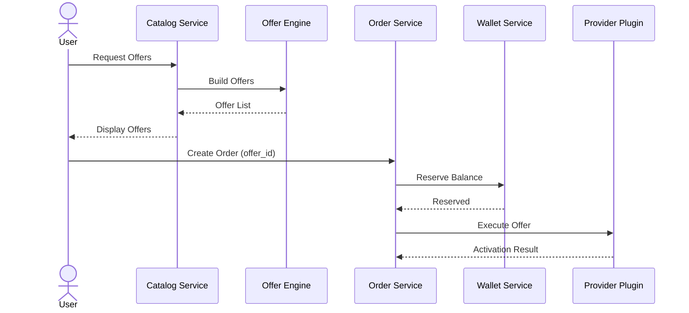

# Architecture

## Core Principle

smsWebsite is built on an **Offer-Based Architecture**.

Providers are considered internal infrastructure and are never exposed to clients.

Users interact only with **Offers**, while the system is responsible for executing the selected Offer through the appropriate provider.

---

## High-Level Architecture

---

## Order Execution Flow

---

# Responsibility Boundaries

## Catalog Service

Responsible for:

- Managing product metadata
- Returning available Offers
- Serving catalog APIs

Does **not**:

- Communicate directly with providers
- Execute orders
- Apply pricing logic

---

## Offer Engine

Responsible for:

- Collecting provider data
- Normalizing responses
- Building Offers
- Calculating final Offer prices
- Applying margins
- Applying currency conversion
- Ranking Offers

Does **not**:

- Select the final Offer
- Create orders
- Reserve balances

---

## Order Service

Responsible for:

- Creating orders
- Managing order lifecycle
- Reserving wallet balance
- Executing selected Offers
- Receiving activation results

Does **not**:

- Calculate prices
- Rank Offers
- Know provider implementation details

---

## Provider Plugin Layer

Responsible for:

- Communicating with external provider APIs
- Mapping provider responses
- Hiding provider-specific implementations

Providers are **never exposed** outside this layer.

---

# Architecture Principles

- Offer-Based Architecture
- User-Driven Offer Selection
- Hidden Provider Model
- Event-Driven Communication
- Microservice Architecture
- Plugin-Based Provider Integration
- Database per Service
- API-First Design