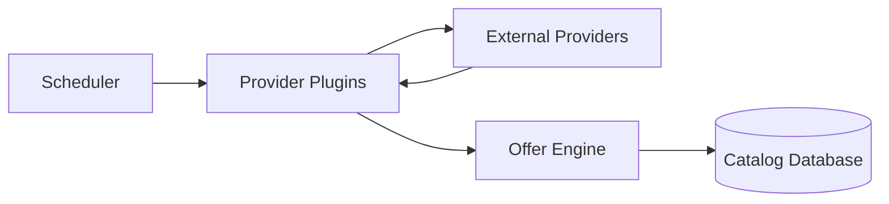
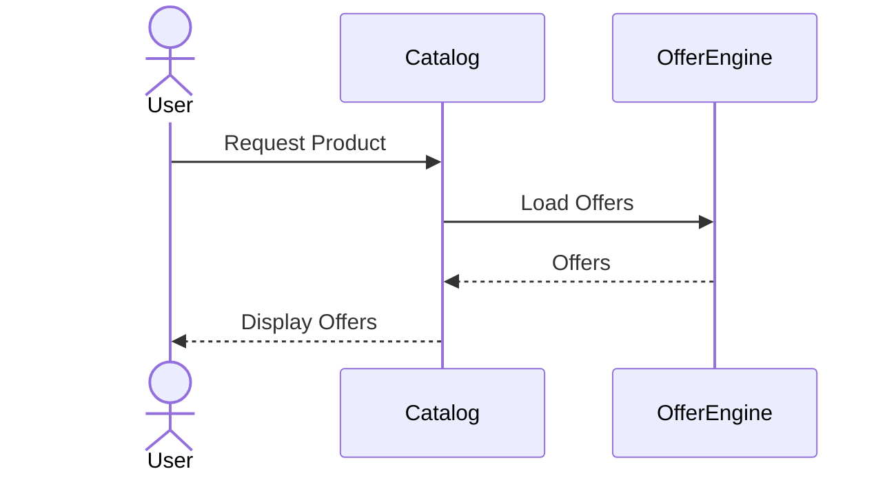
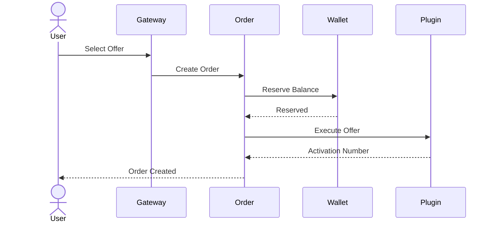
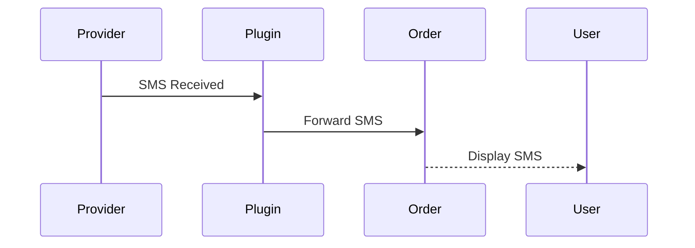
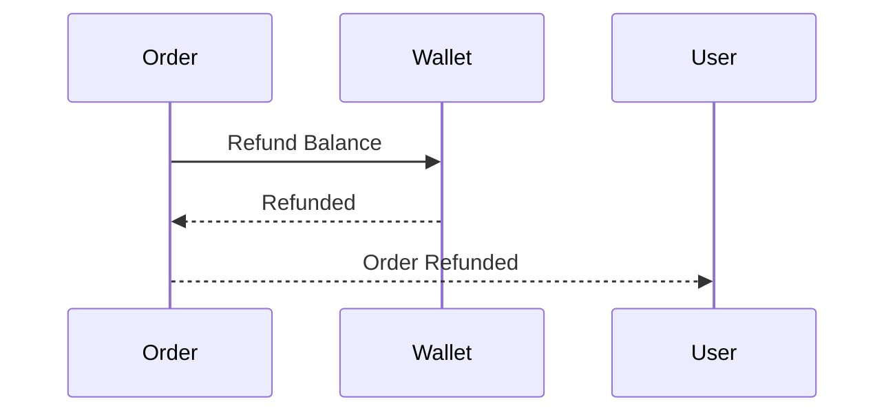

# Workflow

This document describes the primary business workflows of **smsWebsite**.

---

# 1. Catalog Synchronization

The platform continuously synchronizes data from all configured providers.

### Steps

1. Scheduler triggers synchronization.
2. Provider Plugins fetch products, prices and stock.
3. Offer Engine normalizes provider data.
4. Offers are generated.
5. Catalog database is updated.

---

# 2. Browse Offers

Users browse available Offers.

### Steps

1. User opens a product page.
2. Catalog Service loads available Offers.
3. Offer Engine returns normalized Offers.
4. User sees Offer list.

---

# 3. Create Order

The user selects an Offer and creates an order.

### Steps

1. User selects an Offer.
2. Order Service creates the order.
3. Wallet balance is reserved.
4. Provider Plugin purchases the activation.
5. Activation number is returned.

---

# 4. Receive SMS

### Steps

1. Provider receives the verification SMS.
2. Provider Plugin forwards the SMS.
3. Order Service stores the message.
4. User retrieves the SMS.

---

# 5. Refund Flow

### Trigger Conditions

A refund may occur when:

- Provider cannot allocate a number.
- Activation expires.
- Provider reports an unrecoverable failure.
- Manual refund is requested by an administrator.

---

# Workflow Principles

- Users select Offers, not Providers.
- Providers are internal implementation details.
- Services communicate through APIs and domain events.
- Orders always reference an Offer.
- Pricing is determined before order creation.
- Every workflow is traceable using a Correlation ID.