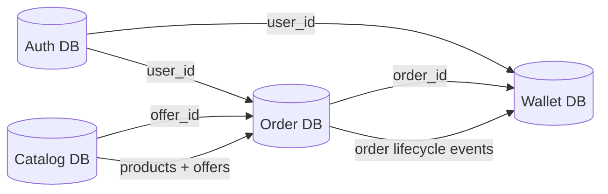

# Database Design Overview

This folder contains all database schemas, ERD diagrams, and data flow designs.

---

## Databases

- Auth DB → Users & roles
- Catalog DB → Products & offers
- Order DB → Offer lifecycle execution
- Wallet DB → Payments & transactions

---

## Overall Database Relationship

---

## Includes

- ERD diagrams (Mermaid)
- Data flow models
- Indexing strategy

---

## Key Idea

- Auth DB handles identity & roles
- Catalog DB handles products + offers
- Order DB executes offers only
- Wallet DB handles financial transactions

All cross-database relations are handled via **IDs + services**, not foreign keys.