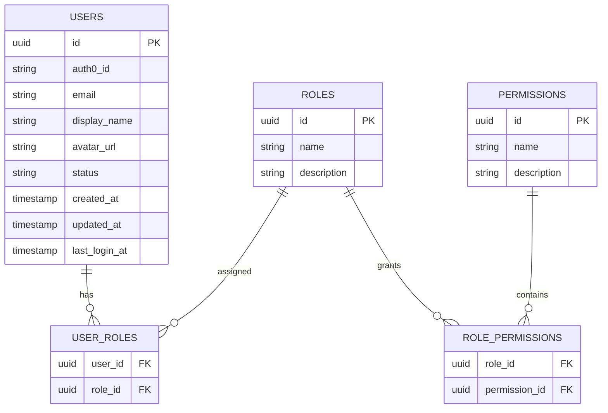

# Auth Service Database

The Auth Service manages user profiles and authorization.

Authentication is delegated to **Auth0**, while authorization is handled internally.

---

# Entity Relationship



---

# Table: users

```sql
CREATE TABLE users (
    id UUID PRIMARY KEY,

    auth0_id VARCHAR(100) UNIQUE NOT NULL,

    email VARCHAR(255) UNIQUE NOT NULL,

    display_name VARCHAR(255),

    avatar_url TEXT,

    status VARCHAR(20) NOT NULL,

    created_at TIMESTAMP NOT NULL,

    updated_at TIMESTAMP NOT NULL,

    last_login_at TIMESTAMP
);
```

---

# Table: roles

```sql
CREATE TABLE roles (
    id UUID PRIMARY KEY,

    name VARCHAR(100) UNIQUE NOT NULL,

    description TEXT
);
```

---

# Table: permissions

```sql
CREATE TABLE permissions (
    id UUID PRIMARY KEY,

    name VARCHAR(100) UNIQUE NOT NULL,

    description TEXT
);
```

---

# Table: user_roles

```sql
CREATE TABLE user_roles (

    user_id UUID NOT NULL,

    role_id UUID NOT NULL,

    PRIMARY KEY (user_id, role_id),

    FOREIGN KEY (user_id)
        REFERENCES users(id),

    FOREIGN KEY (role_id)
        REFERENCES roles(id)
);
```

---

# Table: role_permissions

```sql
CREATE TABLE role_permissions (

    role_id UUID NOT NULL,

    permission_id UUID NOT NULL,

    PRIMARY KEY (role_id, permission_id),

    FOREIGN KEY (role_id)
        REFERENCES roles(id),

    FOREIGN KEY (permission_id)
        REFERENCES permissions(id)
);
```

---

# Design Principles

- Authentication is delegated to Auth0.
- Authorization is managed internally.
- Users may have multiple roles.
- Roles may contain multiple permissions.
- Provider authentication is outside the responsibility of this service.