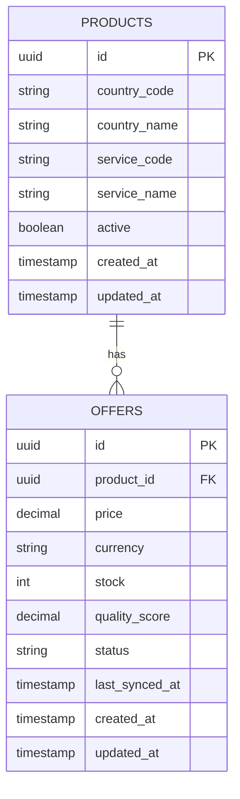

# Catalog Database

## Purpose

Stores the user-facing marketplace data including Products and their available Offers.

Providers are completely hidden and never stored in this database.

---

# Entity Relationship



---

# Table: products

```sql
CREATE TABLE products (
    id UUID PRIMARY KEY,

    country_code VARCHAR(10) NOT NULL,
    country_name VARCHAR(100) NOT NULL,

    service_code VARCHAR(50) NOT NULL,
    service_name VARCHAR(100) NOT NULL,

    active BOOLEAN NOT NULL DEFAULT TRUE,

    created_at TIMESTAMP NOT NULL,
    updated_at TIMESTAMP NOT NULL
);
```

---

# Table: offers

```sql
CREATE TABLE offers (
    id UUID PRIMARY KEY,

    product_id UUID NOT NULL,

    price DECIMAL(10,4) NOT NULL,
    currency VARCHAR(10) NOT NULL,

    stock INT NOT NULL,

    quality_score DECIMAL(5,2),

    status VARCHAR(20) NOT NULL,

    last_synced_at TIMESTAMP,

    created_at TIMESTAMP NOT NULL,
    updated_at TIMESTAMP NOT NULL,

    FOREIGN KEY (product_id)
        REFERENCES products(id)
);
```

---

# Indexes

## products

- (country_code)
- (service_code)
- (active)

## offers

- (product_id)
- (price)
- (status)
- (stock)
- (quality_score)

---

# Design Rules

- Products represent stable marketplace entities.
- Offers represent dynamic purchasable options.
- Providers are never stored or exposed.
- Prices belong to Offers only.
- Stock belongs to Offers only.
- Catalog is optimized for read-heavy access patterns.
- All offer data is periodically refreshed by the Offer Engine.