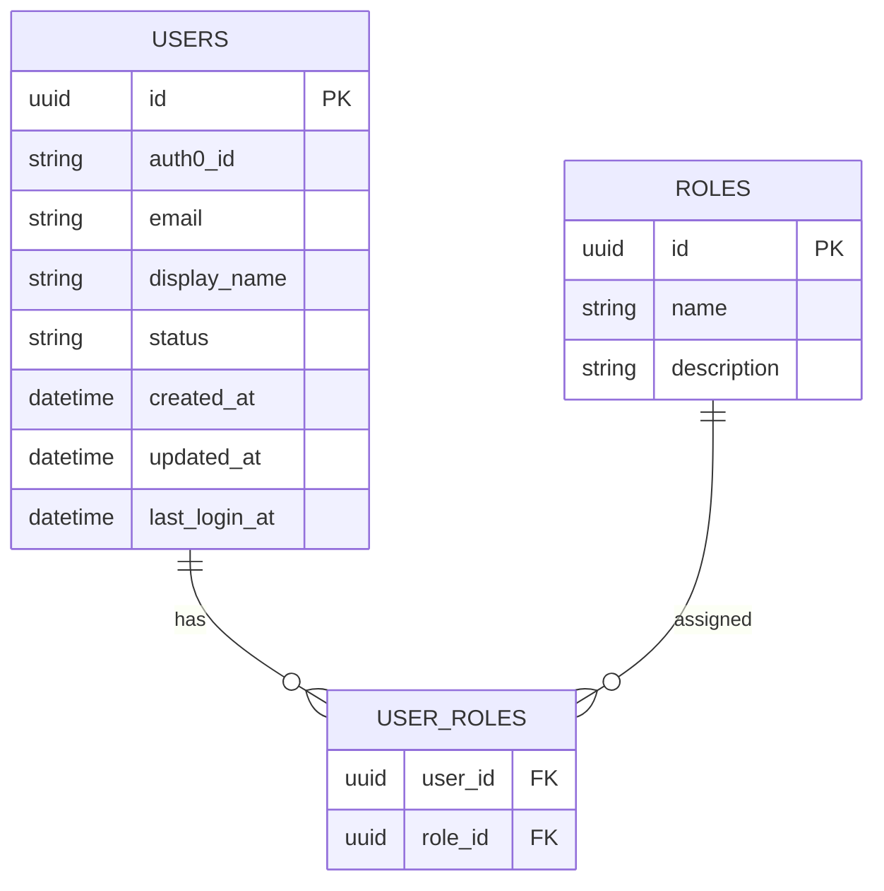

## Entity Relationship

```mermaid
erDiagram

    USERS ||--o{ USER_ROLES : has
    ROLES ||--o{ USER_ROLES : assigned

    USERS {
        uuid id PK
        string auth0_id
        string email
        string display_name
        string status
        datetime created_at
        datetime updated_at
        datetime last_login_at
    }

    ROLES {
        uuid id PK
        string name
        string description
    }

    USER_ROLES {
        uuid user_id FK
        uuid role_id FK
    }
```