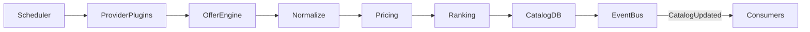

# Catalog Aggregation Flow

## Overview

The Offer Engine periodically synchronizes data from all configured Provider Plugins.

Its responsibility is to generate user-facing Offers while keeping Providers hidden.

---

## Flow

---

## Processing Steps

1. Scheduler triggers a synchronization job.
2. Provider Plugins fetch products, prices, and stock from external providers.
3. Offer Engine normalizes provider-specific data.
4. Offer Engine maps provider products to marketplace Products.
5. Offer Engine generates one or more Offers for each Product.
6. Currency conversion, margins, and pricing rules are applied.
7. Offer quality scores are calculated.
8. Products and Offers are updated in the Catalog Database.
9. A `CatalogUpdated` event is published.

---

## Responsibilities

### Scheduler Service

- Schedule synchronization jobs
- Retry failed synchronizations

---

### Provider Plugins

- Authenticate with providers
- Fetch raw provider data
- Normalize provider-specific API errors

---

### Offer Engine

- Normalize provider data
- Map provider products to marketplace Products
- Generate Offers
- Apply pricing rules
- Calculate quality scores
- Update Catalog Database

The Offer Engine **never selects an Offer for the user**.

---

### Catalog Service

- Serve read-only catalog data
- Expose Products and Offers through APIs

---

## Key Rules

- Catalog is **read-only** from the API side.
- Only the **Offer Engine Service** writes to the Catalog Database.
- Provider information is never exposed to clients.
- Multiple Offers may exist for the same Product.
- The user's selected Offer is preserved without modification by the Order Service.