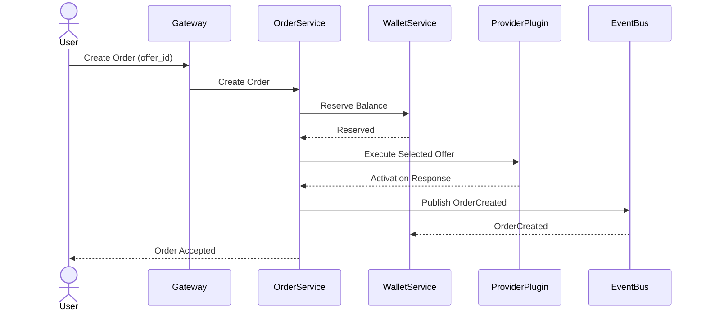

# Order Write Flow

## Overview

The Order Service executes a user-selected Offer.

The system never selects an Offer on behalf of the user.

---

## Flow



---

## Processing Steps

1. User selects an Offer.
2. User submits the selected `offer_id`.
3. Order Service validates the Offer.
4. Wallet Service reserves the required balance.
5. Order Service executes the selected Offer through the corresponding Provider Plugin.
6. Activation information is stored.
7. Order status is updated.
8. Order-related events are published.

---

## Order State Flow

```text
CREATED
→ RESERVED
→ SENT_TO_PROVIDER
→ WAITING_SMS
→ COMPLETED

FAILED
↘
REFUNDED
```

---

## Responsibilities

### User

- Select the Offer
- Submit the selected Offer

### Order Service

- Validate request
- Execute the selected Offer
- Manage the order lifecycle
- Publish domain events

### Wallet Service

- Reserve balance
- Capture payment after successful activation
- Release or refund reserved balance if needed

### Provider Plugin

- Execute the activation request
- Retrieve activation status
- Retrieve SMS messages

---

## Key Rules

- The user always selects the Offer.
- Order Service never ranks or selects Offers.
- Provider identity remains hidden from users.
- Wallet reservation happens before provider execution.
- All state changes are published as domain events.