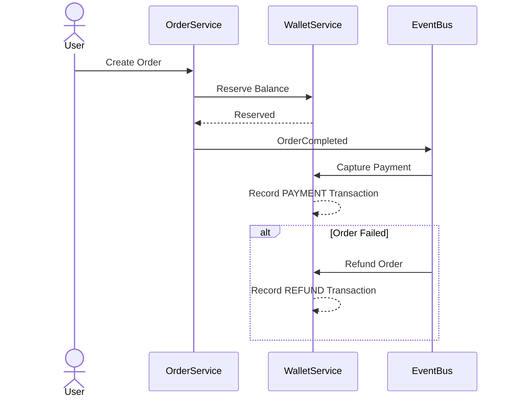

# Wallet Transaction Flow

## Overview

The Wallet Service is responsible for all financial operations.

Every balance change must be recorded as a transaction.

The wallet balance is derived from completed transactions.

---

## Transaction Types

- DEPOSIT
- WITHDRAW
- PAYMENT
- REFUND

---

## Transaction Flow

---

## Processing Steps

1. User creates an Order.
2. Wallet Service reserves the required balance.
3. Provider execution completes.
4. If successful, the reserved balance is captured as a `PAYMENT` transaction.
5. If the Order fails, a `REFUND` transaction is created.
6. Wallet balance is updated.

---

## Design Rules

- Every balance change creates a transaction.
- Wallet balance is derived from successful transactions.
- Payment and refund operations are idempotent.
- Financial operations are event-driven.
- Transactions are immutable after completion.
- Order Service never updates wallet balances directly.