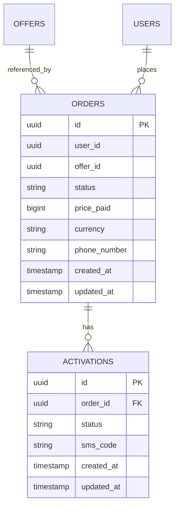

# Order Database

## Purpose

Stores user purchase transactions based on selected Offers.

Order is the execution layer of an Offer.

Providers are completely hidden.

---

# Entity Relationship



---

# Table: orders

```sql
CREATE TABLE orders (

    id UUID PRIMARY KEY,

    user_id UUID NOT NULL,

    offer_id UUID NOT NULL,

    status VARCHAR(30) NOT NULL,

    price_paid BIGINT NOT NULL,

    currency VARCHAR(10) NOT NULL,

    phone_number VARCHAR(50),

    created_at TIMESTAMP NOT NULL,

    updated_at TIMESTAMP NOT NULL,

    FOREIGN KEY (offer_id)
        REFERENCES offers(id)
);
```

---

# Table: activations

```sql
CREATE TABLE activations (

    id UUID PRIMARY KEY,

    order_id UUID NOT NULL,

    status VARCHAR(30) NOT NULL,

    sms_code TEXT,

    created_at TIMESTAMP NOT NULL,

    updated_at TIMESTAMP NOT NULL,

    FOREIGN KEY (order_id)
        REFERENCES orders(id)
);
```

---

# Order Status Flow

```text
CREATED
→ RESERVED
→ SENT_TO_PROVIDER
→ WAITING_SMS
→ COMPLETED
→ FAILED
→ REFUNDED
```

---
---

# Design Rules

- Order is always based on a single Offer
- Provider is never referenced
- Price is snapshot from Offer at purchase time
- Order is immutable after creation (except status)
- Activation is lifecycle of delivery